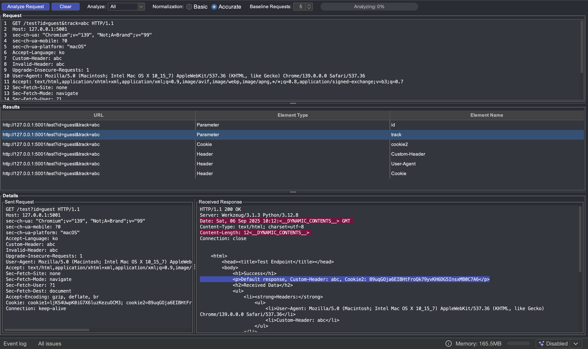

# PacketPurifier

**PacketPurifier** is a Burp Suite extension designed to identify elements of packet (parameters, cookies, and headers) that influence server responses.

## How It Works

PacketPurifier sends the request multiple times (adjustable) to establish a baseline. It then removes each element one by one, observing changes in the response compared to the baseline. Elements causing differences are considered influential. Two normalization methods are available for baseline establishment:

- **Basic** (default): When establishing the baseline, it removes entire lines in the response that display changes.
- **Accurate**: When establishing the baseline, it precisely identifies and removes only the variable parts of the response. (This is significantly influenced by the number of baseline requests; more requests lead to greater precision.)

Analysis results are displayed in the Results panel, and a streamlined request containing only influential elements is sent to Repeater.

## Features

- **Highlighting the differences**: Highlight the lines where differences occur in the response. (Normalized parts during baseline establishment are highlighted in dark magenta, and the parts influenced by influential elements are shown in light blue.)
- **Element Filtering**: It can choose which elements to include in the analysis.

## Installation

1. **Cloning the Repository**:
   - Clone or download the extension from the repository: `git clone https://github.com/isacaya/PacketPurifier.git`.

2. **Build the Extension**:
   - Run `./gradlew build` or `./gradlew jar`.

3. **Load in Burp Suite**:
   - Open Burp Suite
   - Go to `Extensions > Installed > Add`.
   - Select the `PacketPurifier/build/libs/PacketPurifier.jar` file and load it.
   - The "PacketPurifier" tab will appear in the Burp Suite interface.

## How to Use

Send the request packet to analyze to PacketPurifier via the context menu, then start Analyze Request. Check the results in the Results and Details panels below.

## Notes

- Elements that do not affect or are not reflected in the response cannot be identified. (It may not be helpful when testing for blind vulnerabilities.)